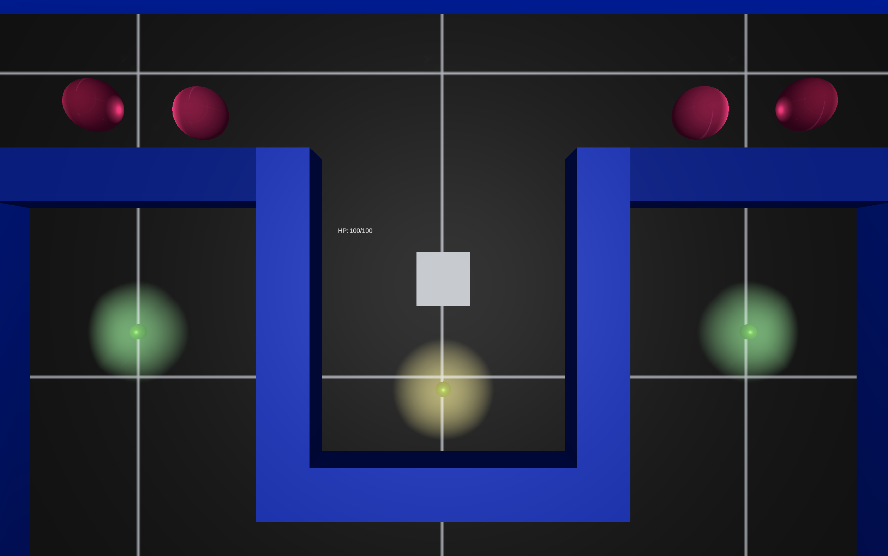

# Lasermite

The aim of this project is to make an arcade Gauntlet-style game.



## Developing

> Unity Editor Version 2019.2.11f1

* Clone the repository
```shell
git clone https://github.com/TriNerdia/Lasermite.git
```

* Open up Unity Hub
* Click the Add button and browse to the Lasermite directory

### Building

The game will simply build using the Unity editor.

## Features

* Single player
* Sword battles
* Enemy AI

## Contributing

If you'd like to contribute, please fork the repository and use a feature
branch. Pull requests are warmly welcome.

## Links

* Project homepage: https://github.com/TriNerdia/Lasermite
* Repository: https://github.com/TriNerdia/Lasermite
* Issue tracker: https://github.com/TriNerdia/Lasermite/issues

## Licensing

This project is licensed under the MIT license.